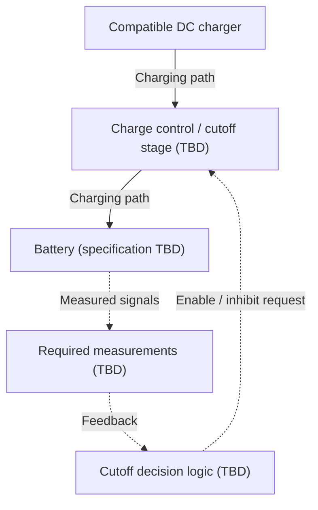

# Automatic Charging Cutoff

A starting point for developing and validating a controller that stops battery
charging when a defined charge-completion condition or fault is detected.

## Current status

**Documentation foundation only.** This repository contains no firmware,
schematic, bill of materials, simulation model, or test results. Simulation
success and a working hardware prototype have **not been demonstrated here**.
Any work outside this repository is unverified.

The diagram and behavior below describe a **proposed design**, not an
implemented or tested system.

## Hardware scope and open decisions

The proposed scope is a low-voltage DC charging-cutoff prototype. A suitable
charger would provide the battery-specific charging profile; this project would
supervise whether charging is enabled. It is not a complete charger or battery
management system.

| Item | Decision still needed |
| --- | --- |
| Battery | Chemistry, cell count, capacity, and manufacturer limits |
| Charger / supply | Compatible charging profile and voltage/current ratings |
| Measurements | Which voltage, current, and/or temperature signals are required |
| Decision logic | Analog circuit, microcontroller, or a combination |
| Cutoff stage | Charger-enable control or a suitably rated disconnect circuit |
| Settings | Completion criterion, fault limits, timing, and restart policy |

No board, sensor, relay, MOSFET, pin assignment, or numeric threshold is selected
by this foundation. Firmware is a reserved area if the design needs it.

## Conceptual block diagram

Solid arrows show the conceptual charging path; dashed arrows show signals.
This is a functional diagram, not a wiring schematic. The final design must
resolve charger compatibility, sensing locations, ratings, and isolation needs.

## Proposed cutoff and protection behavior

These are design targets to review and test after the hardware scope is chosen.

| Condition | Intended response / unresolved detail |
| --- | --- |
| Startup or controller reset | Keep charging inhibited until required measurements and configuration are valid. |
| Normal charging | Permit charging only while the defined operating conditions are satisfied. |
| Charge-completion criterion reached | Request charging cutoff; the criterion must be chosen for the selected battery and charger. |
| Invalid required measurement or detected out-of-limit condition | Request charging inhibition and record/indicate the reason if the selected design supports it. |
| Restart after cutoff | Policy is undecided; define manual reset or automatic restart, including any hysteresis and delay, before implementation. |

There is no verified overvoltage, overcurrent, overtemperature, short-circuit,
reverse-polarity, or failed-switch protection in this repository. Decide which
protections are provided by the charger, battery protection circuit, or this
controller and document their limits. A cutoff request alone is not evidence
that charging current has stopped.

## Repository layout

| Location | Purpose |
| --- | --- |
| [firmware/](firmware/) | Future source code and build/flash instructions, if a microcontroller is used |
| [schematics/](schematics/) | Future circuit sources, readable exports, wiring details, and component list |
| [validation/](validation/) | Planned checks and future simulation or hardware evidence |

There is currently nothing to build, flash, or simulate.

## First implementation steps

1. Choose the battery and compatible charger; document their limits and sources.
2. Select sensing, decision logic, and cutoff hardware; define completion,
   fault, startup, and restart behavior.
3. Add the schematic and any required firmware with reproducible instructions.
4. Run the checks in [validation/README.md](validation/README.md), label each
   result as simulation or hardware, and update status only when evidence exists.
