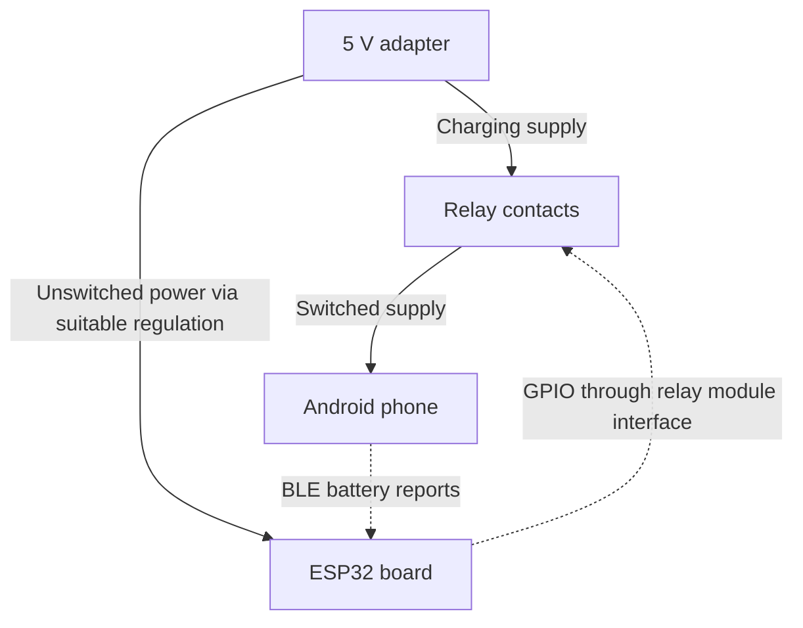

# Android-Reported Mobile Charging Cutoff

An ESP32-based controller that disconnects a mobile phone's 5 V charging supply when an Android app reports that its battery has reached 100%.

**Status:** Android app and ESP-IDF firmware source are included. Host tests and the Android debug build/lint pass;
ESP32 target-build and phone/BLE/relay hardware validation are pending. See [validation](validation/README.md)
for the build evidence and remaining checks.

Project behavior

- An Android app reads the phone-reported battery percentage.
- The app sends that percentage to the ESP32 over Bluetooth Low Energy (BLE).
- The ESP32 controls a 5 V relay module to connect or disconnect the phone's supply.
- The INA219 is optional for monitoring current; it does not decide the cutoff.
- Communication is local, with no cloud service or internet connection required.

The percentage is the phone's own state-of-charge estimate. The phone's internal charging electronics continue to manage its battery.

## Hardware and software

| Part | Role |
| --- | --- |
| Android 8.0+ phone and app | Read and report battery percentage |
| Original ESP32 board (initial build target) | Receive reports and control the relay |
| 5 V adapter | Provide the charging supply |
| 5 V relay module | Switch the phone's charging supply |
| Kotlin / Android Studio | Develop the Android app |
| ESP-IDF 5.4.2 | Develop the ESP32 firmware |

The actual board and relay module still need to be identified and tested. Relay GPIO
and polarity are configurable; the GPIO defaults to **-1 (physical output disabled)**
until wiring is confirmed. See [hardware guidance](schematics/README.md).

## Functional diagram

This is a functional diagram. Relay-module power, grounds, USB connector wiring, and the optional INA219 are omitted. The controller must remain powered after the phone's charging supply is disconnected.

## Implemented control logic

| Condition | Software response |
| --- | --- |
| Power-up or reset | Keep the phone's supply disconnected until the user starts a session and a valid battery report is received. |
| Active session, fresh report below 100% | Permit charging. |
| Fresh report reaches 100% | Disconnect charging and keep it off for that session. |
| BLE disconnects | Disconnect charging and end the session. |
| Battery reports become invalid or stale | Command OFF immediately for an invalid authenticated message, or after the 90-second report timeout; latch the fault. |
| User starts a new session | Require a fresh, valid report below 100% before enabling charging again. |

The app sends percentage changes and a **30-second heartbeat**. The firmware uses
a **90-second report timeout**, checked every 100 ms. Completed and faulted
sessions remain off; starting again requires a new connection and user action.
Authenticated BLE pairing uses a random PIN shown in the ESP32 serial monitor.
The [shared protocol](docs/BLE_PROTOCOL.md) specifies acknowledgement and replay checks.

A user-started Android foreground service and a bounded, refreshed partial wake
lock support reporting with the screen locked. They consume phone energy; the
amount and reliability under phone power-management settings have not been measured.
Reporting stops when the session ends. The UI reports relay commands, not measured
contact state. A powered-off phone must first be charged enough to run the app.

## Source areas

| Folder | Contents |
| --- | --- |
| [`android-app/`](android-app/README.md) | Kotlin app, Gradle wrapper and build/install instructions |
| [`firmware/`](firmware/README.md) | ESP-IDF C firmware, FreeRTOS timeout task and configuration |
| [`schematics/`](schematics/README.md) | Functional wiring guidance; no validated circuit export yet |
| [`validation/`](validation/README.md) | Host tests, evidence and pending hardware checklist |
| `docs/` | BLE protocol and state diagram |
| `tools/` | Portable host-test runner |

These folders contain source and documentation. GitHub Actions defines Android,
ESP32 and host checks; a workflow file alone is not evidence of a successful run.

## Build and validate

1. Follow the [firmware guide](firmware/README.md): configure the board GPIO/polarity,
   build with ESP-IDF 5.4.2, then flash and open the serial monitor.
2. Follow the [Android guide](android-app/README.md): open in Android Studio or run
   `./gradlew assembleDebug lintDebug` from `android-app/`, then install on your phone.
3. Run `python3 tools/test_host.py` at the repository root (C compiler and JDK 17).
4. Verify the relay with a low-voltage dummy load, then pair the phone and test the
   [hardware checklist](validation/README.md), including screen-locked reporting.

Reported 100% is the control trigger. Overcurrent, overtemperature, and other battery-protection functions are not established by this design.

## Technical references

- [Android BatteryManager](https://developer.android.com/reference/android/os/BatteryManager)
- [Android BLE overview](https://developer.android.com/develop/connectivity/bluetooth/ble/ble-overview)
- [Android BLE background operation](https://developer.android.com/develop/connectivity/bluetooth/ble/background)
- [ESP-IDF NimBLE](https://docs.espressif.com/projects/esp-idf/en/stable/esp32/api-reference/bluetooth/nimble/index.html)
