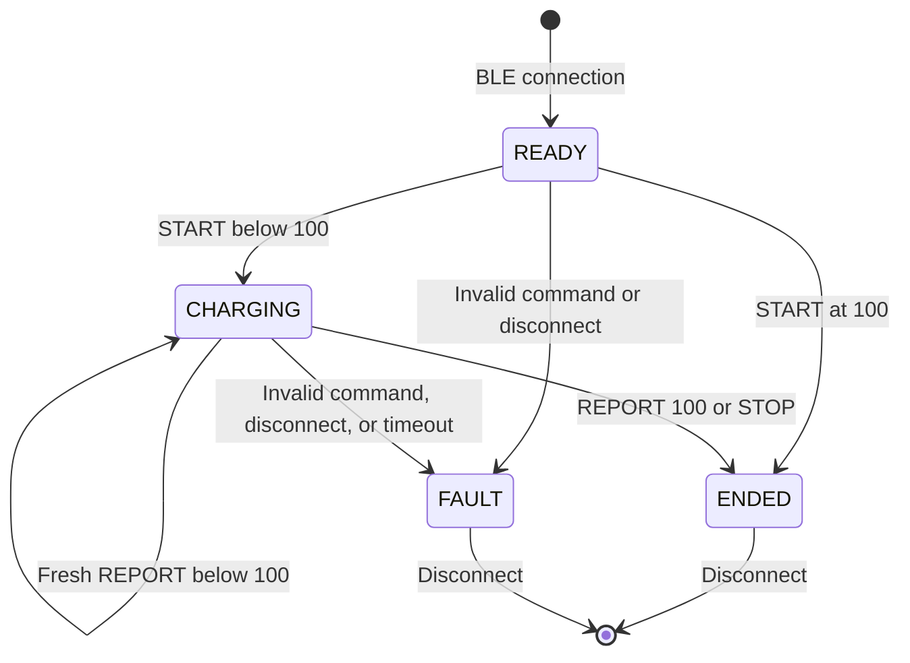

# BLE protocol v1

Android is the BLE central; the ESP32 is the peripheral named `ChargeCutoff`.
All multibyte integers are **unsigned, little-endian**. Messages fit the default
23-byte ATT MTU. Only one phone can connect at a time.

| Attribute | UUID | Access |
| --- | --- | --- |
| Service | `7d7e0001-8c6e-4d26-b11c-63430d8b23cc` | Advertised |
| Command | `7d7e0002-8c6e-4d26-b11c-63430d8b23cc` | Write with response |
| Status | `7d7e0003-8c6e-4d26-b11c-63430d8b23cc` | Read, notify |

## Pairing and session start

Firmware requests bonding, authenticated pairing, and LE Secure Connections.
Enter the random six-digit PIN printed by the ESP32 serial monitor in Android's
system pairing dialog. The firmware has display-only I/O capability, with the
serial monitor acting as its display. Command writes and status reads require
an encrypted, authenticated connection. No shared static PIN is in the source.
Protect access to the monitor when pairing.

After pairing, subscribe to the Status CCCD, then read Status. Require READY and
a nonzero connection nonce. Generate a nonzero random session ID; send START with
sequence 1 and a fresh phone-reported percentage. After each command write,
read Status and verify the nonce, session and accepted sequence. An ATT write
completion alone does not acknowledge that charging was enabled. Android GATT
operations are serialized.

The nonce changes at each BLE connection. It separates connections; authenticated
encryption provides link security. Sequences reject old commands within a
session. Random 32-bit IDs are not an absolute uniqueness guarantee or a separate
application-layer cryptographic protocol.

## Command: exactly 16 bytes

| Byte(s) | Field | Values |
| --- | --- | --- |
| 0 | Version | 1 |
| 1 | Operation | 1 START, 2 REPORT, 3 STOP |
| 2 | Percentage | 0–100 for START/REPORT; 255 for STOP |
| 3 | Reserved | 0 |
| 4–7 | Connection nonce | Nonzero, from current Status |
| 8–11 | Session ID | Nonzero; fixed for this session |
| 12–15 | Sequence | START = 1; later values strictly increase; never wrap |

Golden START: battery 99, nonce `0x11223344`, session `0xaabbccdd`, sequence 1:
`0101630044332211ddccbbaa01000000`.

## Status: exactly 20 bytes

| Byte(s) | Field | Values |
| --- | --- | --- |
| 0 | Version | 1 |
| 1 | State | 0 READY, 1 CHARGING, 2 ENDED, 3 FAULT |
| 2 | Reason | See below |
| 3 | Relay command | 0 OFF, 1 ON; not contact feedback |
| 4–7 | Connection nonce | Current connection |
| 8–11 | Session ID | 0 before START |
| 12–15 | Last accepted sequence | 0 before START; rejected commands do not advance it |
| 16 | Last accepted percentage | 0–100, or 255 if unknown |
| 17–19 | Reserved | 0 |

| Reason | Meaning |
| --- | --- |
| 0 | No fault / ready |
| 1 | 100% cutoff |
| 2 | Manual stop |
| 3 | BLE disconnected |
| 4 | Report timeout |
| 5 | Malformed message or invalid percentage |
| 6 | Wrong session, nonce, or invalid START |
| 7 | Replayed/non-increasing sequence |
| 8 | Controller reset (initial local state) |

## State rules

ENDED and FAULT latch for that connection. Further commands cannot turn charging
back on. A new session requires disconnecting and explicitly starting again.
START at 100 never briefly commands ON. No automatic recharge is implemented.

The app reports percentage changes and sends a heartbeat 30 seconds after each
acknowledgement. The default firmware timeout is 90 seconds after the last
accepted report. A 100 ms task checks the deadline; actual GPIO response includes
scheduling latency. Commands check the deadline before accepting a packet, so a
late heartbeat cannot revive a session. An ordinary BLE disconnect commands OFF
when its event arrives; radio loss may first wait for supervision or report timeout.

Malformed commands on an authenticated connection fault an open session.
Unauthorized GATT access is rejected and never counts as a battery report.
Notifications report state changes; explicit reads acknowledge commands.
